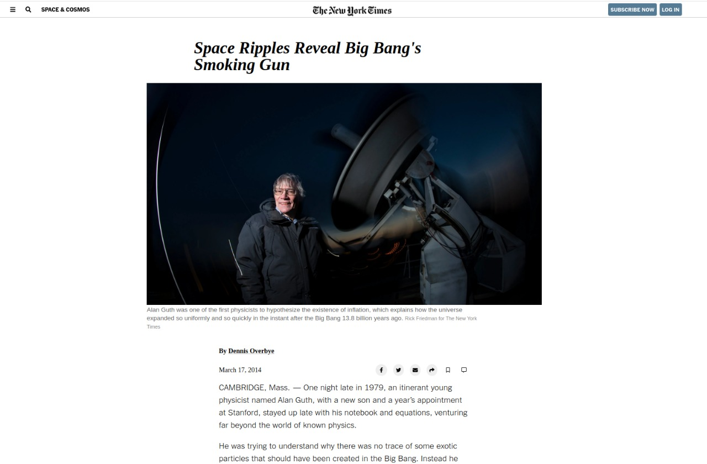

# Project Name

> The aim of this project was to copy [this](https://www.nytimes.com/2014/03/18/science/space/detection-of-waves-in-space-buttresses-landmark-theory-of-big-bang.html?_r=0) website applying the following concepts; Embedding images, Working with forms (buttons in this case), Floats and positioning and the box model.   

## Built With

HTML, CSS.

## Live Demo

[Live Demo Link](https://raw.githack.com/epinczinger/newyork_times/main_page/index.html)

## Authors

👤 **Author1**

- Github: [@wrakc](https://github.com/wrack)
- Twitter: [@carlosveig](https://twitter.com/carlosveig)
- Linkedin: [linkedin](https://linkedin.com/chveiga)

👤 **Author2**

- Github: [@epinczinger](https://github.com/epinczinger)
- Twitter: [@epinczinger](https://twitter.com/epinczinger)
- Linkedin: [linkedin](https://linkedin.com/epinczinger)

## 🤝 Contributing

Contributions, issues and feature requests are welcome!

Feel free to check the [issues page](https://github.com/epinczinger/newyork_times/issues).

## Show your support

Give a ⭐️ if you like this project!

## Acknowledgments

Thanks Microverse for the opportunity.
Thanks to the raggydolls and the minskins.

## 📝 License

This project has no license.
